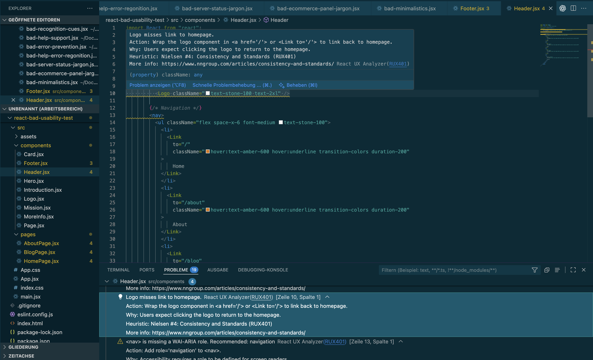

# React UX Analyzer

> Automatically detect **UI/UX issues** in React (JSX) projects based on **Nielsen's 10 Heuristics**. 
> Includes **visual quality scoring** powered by **NIMA** (Neural Image Assessment).

## ✨ Features

React UX Analyzer statically analyzes your JSX code and provides heuristic-based usability feedback directly in **VS Code’s Problems Panel**.

The following **Heuristic Detections (based on Nielsen’s 10 Usability Heuristics)** are supported:

📄 [Get to know more about Heuristic Analysis](./src/heuristics/HEURISTICS.md)

| Supported Heuristics                        | Description | More Info |
|-----------------------------------------------|-------------|-----------------|
| #1 Visibility of System Status                | Detect missing breadcrumb navigation and loading cues. | [Breadcrumb Documentation](./1-visibility-system-status/BREADCRUMB-DETECTION.md), [Loading Documentation](./1-visibility-system-status/LOADING-DETECTION.md) |
| #2 Match System and Real World                | Scans for technical jargon and internal system language. | [Language Documentation](./2-match-system-with-real-world/LANGUAGE-DETECTION.md) |
| #3 User Control and Freedom                   | Flags missing exits in modals and undo options for destructive actions. | [Control Exit Documentation](./3-user-control-freedom/CONTROL-EXIT-DETECTION.md) |
| #4 Consistency and Standards                  | Finds inconsistent UI elements, like logos missing homepage links or use of too many fonts.  | [Page Consistency Documentation](./4-consistency-and-standards/PAGE-CONSISTENCY-DETECTION.md) |
| #5 Error Prevention                           | Flags unhandled error cases for `fetch()`/`axios` calls and modals with destructive language but no cancel option.  | [Error Prevention Documentation](./5-error-prevention/ERROR-PREVENTION-DETECTION.md) |
| #6 Recognition Rather than Recall             | Checks for labels missing placeholders and overloaded navigations | [Recognition Documentation](./6-recognition-rather-recall/RECOGNITION-DETECTION.md) |
| #7 Flexibility and Efficiency of Use          | Detects missing shortcuts or keyboard access in menus and `useEffect()` | [Shortcut Documentation](./7-flexibility-and-efficiency/SHORTCUT-DETECTION.md) |
| #8 Aesthetic and Minimalistic Design      | Scans color usage and calculates low whitespace ratios. |[Aestehtic & Minimalistic Documentation](./8-aesthetic-minimalist-design/AESTHETIC-MINIMALSIM-DETECTION.md) |
| #9 Help Users Recognize and Recover from Errors | Flags technical error messages or missing visual error cues. | [Recognize Errors Documentation](./9-help-recognize-diagnose-recover-errors/HELP-RECOGNIZE-ERRORS-DETECTION.md) |
| #10 Help and Documentation                    | Checks for missing help/support links and onboarding modals without action buttons. | [Help Documentation](./10-help-and-documentation/HELP-DETECTION.md) |

### Visual Quality Scoring (NIMA)
Use **NIMA (Neural Image Assessment)** to calculate a **visual aesthetic score** of your app's UI:

- Takes full-page screenshots (headless via Puppeteer)
- Runs ML model (`mobilenet_weights.h5`) to predict quality
- Outputs a **mean score ± standard deviation**

📄 [Read more about Visual Quality Analysis](./src/visual-quality-analysis/VISUAL-ANALYSIS.md)

### Custom UX Rules

Add your own custom detectors to check for project-specific usability issues.  
📄 [Custom UX Rule Documentation](./utils/CUSTOM-RULES.md)

## 🚀 How to Use

### Via Command Palette
Run any analysis by opening the **Command Palette** (`⇧⌘P` / `Ctrl+Shift+P`) and typing:

- `Analyze UX Heuristics (Not #2 & #8)`
- `Analyze Breadcrumbs (Nielsen #1: Visibility & System Status)`
- `Analyze Loading States (Nielsen #1: Visibility & System Status)`
- `Analyze Match System with Real World (Nielsen #2: Match Between System & Real World)`
- ... and more (see full list below)

### Via on Save
React UX Analyzer can also run automatically whenever you save a `.jsx` file. 
Issues appear instantly in the **Problems Panel**.

### 🛠 Commands Available
| Command | Description |
|-----------|-----------------|
| `Analyze UX Heuristics (Not #2 & #8)` |  Run all main heuristics at once (excludes #2 & #8). |
| `Analyze Breadcrumbs (Nielsen #1: Visibility & System Status)` | Check for missing breadcrumb navigation. |
| `Analyze Loading States (Nielsen #1: Visibility & System Status)` | Detect missing loading UI elements. |
| `Analyze Match System with Real World (Nielsen #2: Match Between System & Real World)` | Flag unclear or jargon-heavy terminology. |
| `Analyze Control Exits (Nielsen #3: User Control & Freedom)` | Ensure modals and destructive actions have exits or undos. |
| `Analyze Page Consistency (Nielsen #4: Consistency & Standards)` | Ensure consistencies troughout components. |
| `Analyze Error Prevention (Nielsen #5: Error Prevention)` | Check for error handling with fetch/axios and cancel option for destructive text in modals. |
| `Analyze Recognition Cues (Nielsen #6: Recognition Rather Than Recall)` | Identify missing placeholders of labels and overloaded navigations. |
| `Analyze Shortcuts (Nielsen #7: Flexibility & Efficiency of Use)` | Detect keyboard shortcuts missing UI display. |
| `Analyze Aesthetic & Minimalist Design (Nielsen #8: Aesthetic & Minimalist Design)` | Scan color overload and whitespace ratios. |
| `Analyze Help for Error Recognition (Nielsen #9: Help Users Recognize, Diagnose, and Recover from Errors)` | Check for technical error messages and missing styling. |
| `Analyze Help and Documentation (Nielsen #10: Help & Documentation)` | Detect missing help/support links or onboarding actions. |
| `Analyze Visual Quality (NIMA)` | Capture screenshot and score UI quality from NIMA. |
| `Analyze Custom UX Rules` | Run your own detectors. |

## Requirements
- Only `.jsx` files are analyzed

### For Code Analysis:
- Works with `.jsx` files 
- VS Code `>= 1.102.0`

#### For Heuristic #2 LLM Analysis:
- Login to [OpenRouter](https://openrouter.ai/settings/keys)
- Obtain an API Key from Button `Create API Key`
- Copy API key (starts with `sk-`)
- Run Command: `🔑 Set OpenRouter API Key` and insert Key value

### For NIMA Visual Quality Analysis:
- NIMA analysis only works for React projects running on Vite or Create React App (`http://localhost:5173` or `http://localhost:3000`)

## Release Notes
### 1.0.0
- Initial release
- Includes UX Heuristics Analysis (JSX)
- Visual Quality Analysis (NIMA) support
- Multi-file analysis with result grouping via FeedbackHandler
- Supports Activation via Commands + on Save

### 1.0.1
- minor bug fixes

### 1.0.2
- change LLM model to llama-4-maverick

## About
This extension was created as a **Master’s Project at TU Chemnitz**.  
It helps React developers integrate usability heuristics directly into their workflow.

### Learn More
- [Nielsen’s 10 Usability Heuristics](https://www.nngroup.com/articles/ten-usability-heuristics/)
- [NIMA: Neural Image Assessment](https://arxiv.org/abs/1709.05424)

**Enjoy building better UI/UX!**
