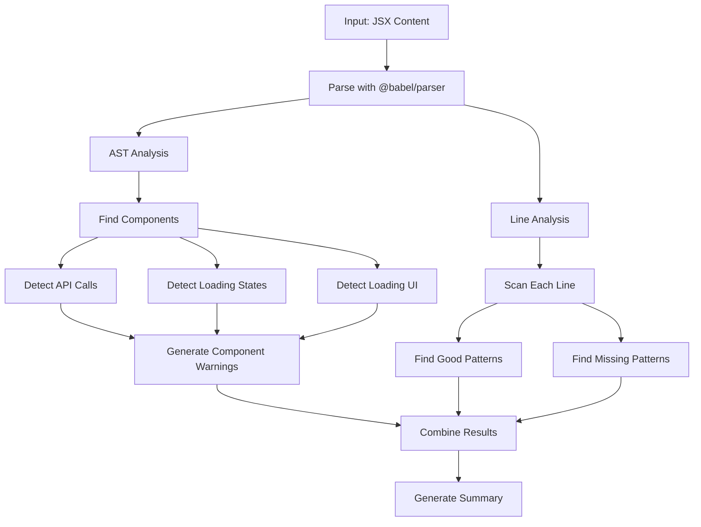

# Loading Detector (`loading-detector.js`)

This detector analyzes React/JSX code to identify loading states and feedback mechanisms, ensuring users always know when the system is processing something (Nielsen Heuristic #1: Visibility of System Status).

## What the Detector Does

The `LoadingDetector` class uses **dual analysis approach** to comprehensively scan JSX code:
- ✅ **Good practices**: Proper loading indicators and state management
- ⚠️ **Warnings**: Missing loading feedback during async operations  
- 💡 **Suggestions**: Potential improvements for loading UX

## How It Works

### Main Function: `detectLoadingPatterns(content)`
```javascript
const detector = new LoadingDetector();
const patterns = detector.detectLoadingPatterns(jsxContent);
const summary = detector.generateSummary(patterns);
```

### **Two-Phase Analysis System**

#### **Phase 1: AST Analysis** (Component-Level Detection)
Uses Abstract Syntax Tree parsing to understand code structure:
1. **`findComponents()`** - Locates all React function components
2. **`detectAPICalls()`** - Finds fetch(), axios, and custom API calls  
3. **`detectLoadingStates()`** - Identifies useState with loading variables
4. **`detectLoadingUI()`** - Locates loading UI components in JSX
5. **`generateComponentWarnings()`** - Reports components with API calls but no loading feedback

#### **Phase 2: Line Analysis** (Specific Pattern Detection)
Scans line-by-line for detailed patterns:
1. **`findGoodLoadingComponents()`** - Identifies loading UI elements
2. **`findGoodLoadingStates()`** - Detects loading state management
3. **`findProgressIndicators()`** - Finds progress bars and indicators
4. **`findSkeletonScreens()`** - Identifies skeleton screens and placeholders
5. **`findMissingFormFeedback()`** - Warns about form submissions without loading states
6. **`findMissingEffectFeedback()`** - Checks useEffect for missing loading feedback

## Detection Patterns

### ✅ **Good Loading Practices** (Found via Line Analysis)

1. **Loading Components & Spinners**
   ```jsx
   <Spinner />
   <LoadingSpinner />
   <Loader />
   <Loading />
   <CircularProgress />
   <LinearProgress />
   ```

2. **Loading State Management** 
   ```jsx
   const [loading, setLoading] = useState(false);
   const [isLoading, setIsLoading] = useState(false);
   const [submitting, setSubmitting] = useState(false);
   ```

3. **Progress Indicators**
   ```jsx
   <ProgressBar />
   <Progress />
   <CircularProgress />
   <StepIndicator />
   ```

4. **Skeleton Screens**
   ```jsx
   <Skeleton />
   <SkeletonLoader />
   <SkeletonText />
   <SkeletonScreen />
   ```

### ⚠️ **Missing Loading Feedback** (Detected via AST + Line Analysis)

#### **AST Analysis Warnings**
- **Components with API calls but no loading states**: When a component has fetch(), axios calls but no loading state management
- **Components with API calls but no loading UI**: When API calls exist but no loading indicators are rendered

#### **Line Analysis Warnings** 
1. **Forms without loading feedback**
   ```jsx
   // Missing loading state
   const handleSubmit = () => {
     fetch('/api/submit', { method: 'POST' }); // No loading indicator!
   };
   ```

2. **useEffect without loading state**
   ```jsx
   // Missing loading state  
   useEffect(() => {
     fetch('/api/data'); // No loading indicator!
   }, []);
   ```

## Technical Implementation

### **AST Analysis Architecture**
```javascript
performASTAnalysis(content) {
  // Parse JSX into Abstract Syntax Tree
  const ast = require('@babel/parser').parse(content, {
    sourceType: 'module',
    plugins: ['jsx', 'typescript']
  });
  
  // Traverse and analyze
  const components = this.findComponents(ast);
  components.forEach(component => {
    const apiCalls = this.detectAPICalls(component);
    const loadingStates = this.detectLoadingStates(component);
    const loadingUI = this.detectLoadingUI(component);
    
    // Generate warnings for components with missing feedback
    this.generateComponentWarnings(component, apiCalls, loadingStates, loadingUI);
  });
}
```

### **Line Analysis Architecture**
```javascript
performLineAnalysis(content) {
  const lines = content.split('\n');
  
  // Scan each line for patterns
  lines.forEach((line, index) => {
    this.findGoodLoadingComponents(line, index);
    this.findGoodLoadingStates(line, index);
    this.findProgressIndicators(line, index);
    this.findSkeletonScreens(line, index);
    this.findMissingFormFeedback(line, index);
    this.findMissingEffectFeedback(line, index);
  });
}
```

### **Key Detection Functions**

#### **Component Detection (AST)**
- `findComponents(ast)` - Locates React function components and arrow functions
- `detectAPICalls(component)` - Finds fetch(), axios.get/post/put(), and custom API patterns
- `detectLoadingStates(component)` - Identifies useState hooks with loading-related variables
- `detectLoadingUI(component)` - Locates JSX elements that show loading states

#### **Pattern Detection (Line Analysis)**
- `findGoodLoadingComponents(line, index)` - Searches for loading UI components
- `findGoodLoadingStates(line, index)` - Finds loading state declarations  
- `findMissingFormFeedback(line, index)` - Warns about form submissions without loading states
- `findMissingEffectFeedback(line, index)` - Checks useEffect hooks for missing feedback

## Best Practices Examples

### ✅ **Good Loading Implementation**

**1. Complete Loading State Management**
```jsx
// GOOD: Full loading feedback cycle
useEffect(() => {
  setLoading(true);
  fetch('/api/data')
    .then(setData)
    .finally(() => setLoading(false));
}, []);

if (loading) return <Spinner />;
```

**2. Form Submission with Loading**
```jsx
// GOOD: Form with loading state and disabled button
const handleSubmit = async (data) => {
  setSubmitting(true);
  try {
    await submitForm(data);
  } finally {
    setSubmitting(false);
  }
};

<button type="submit" disabled={submitting}>
  {submitting ? 'Submitting...' : 'Submit'}
</button>
```

**3. Progress Indication**
```jsx
// GOOD: Progress bar for longer operations
{uploading && (
  <div>
    <ProgressBar value={uploadProgress} />
    <span>{uploadProgress}% uploaded</span>
  </div>
)}
```

## Example Usage

```javascript
const LoadingDetector = require('./loading-detector');
const detector = new LoadingDetector();

// Example JSX code to analyze
const jsxCode = `
function UserProfile({ userId }) {
  const [user, setUser] = useState(null);
  const [loading, setLoading] = useState(false);

  useEffect(() => {
    setLoading(true);
    fetchUser(userId)
      .then(setUser)
      .finally(() => setLoading(false));
  }, [userId]);

  if (loading) {
    return <Spinner />;
  }

  return <div>{user?.name}</div>;
}
`;

// Run analysis
const results = detector.detectLoadingPatterns(jsxCode);
const summary = detector.generateSummary(results);

// Output results
console.log(`✅ Found ${summary.goodPractices} good practices`);
console.log(`⚠️ Found ${summary.warnings} warnings`);

// Detailed results
results.patterns.forEach(pattern => {
  console.log(`${pattern.severity}: ${pattern.description} (Line ${pattern.line})`);
});
```

## Detection Algorithm Flow



## Pattern Recognition Details

### **AST Analysis Patterns**
- **Function Components**: `function ComponentName()`, `const ComponentName = ()`, `ComponentName = ()`
- **API Call Patterns**: `fetch()`, `axios.get/post/put/delete()`, `.get()`, `.post()`, custom API methods
- **Loading State Patterns**: `useState` hooks with variables containing `loading|isLoading|fetching|submitting`
- **Loading UI Patterns**: JSX elements with loading-related names in component render

### **Line Analysis Patterns**

#### **Good Patterns**
- **Component names**: `/Loading|Loader|Spinner|Progress|ActivityIndicator|CircularProgress|LinearProgress/`
- **State variables**: `/useState.*loading|isLoading|fetching|submitting|pending/`  
- **Progress indicators**: `/ProgressBar|Progress|StepIndicator|CircularProgress/`
- **Skeleton screens**: `/Skeleton|SkeletonLoader|SkeletonText|SkeletonScreen|Shimmer/`

#### **Warning Patterns**
- **Async operations**: `/fetch\(|axios\.|\.get\(|\.post\(|api\.|getData|fetchData/`
- **Form submissions**: `/onSubmit|handleSubmit|submitForm|form.*submit/`
- **useEffect hooks**: Checks for async operations in useEffect without loading states
- **Missing disabled states**: Form buttons without disabled props during loading

### **Priority Scoring**
- **High Priority**: AST-detected components with API calls but no loading feedback
- **Medium Priority**: Line-detected form submissions and useEffect calls without loading
- **Low Priority**: Missing progress indicators and enhanced loading states
